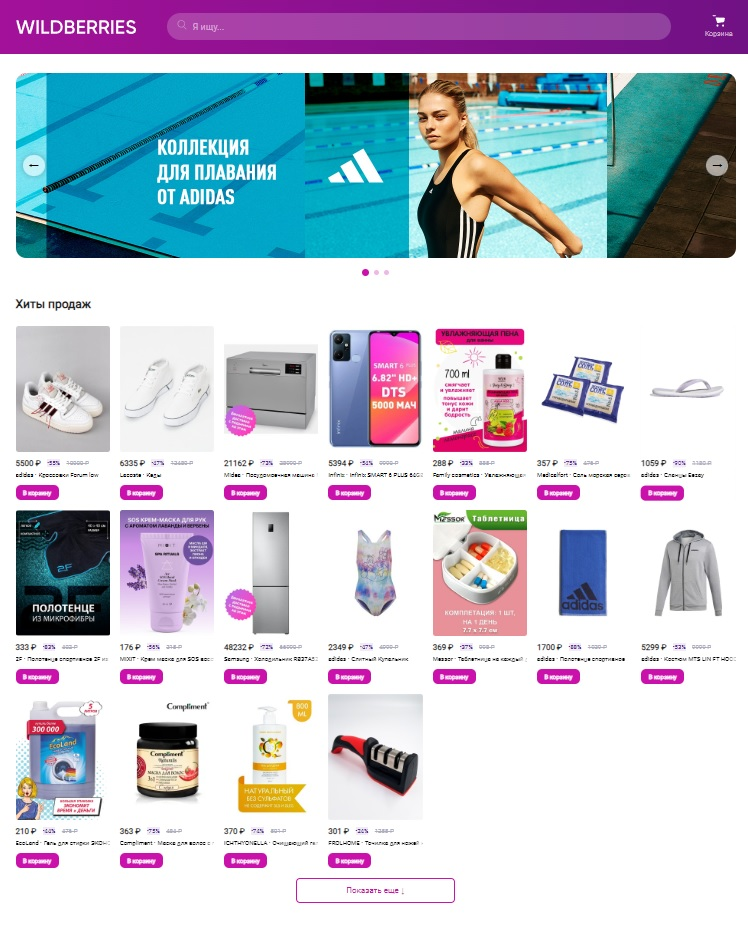
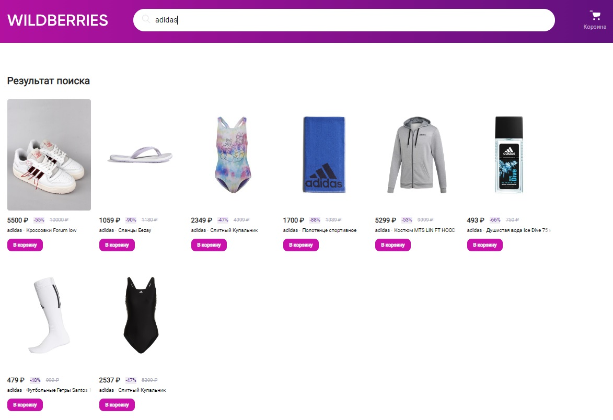
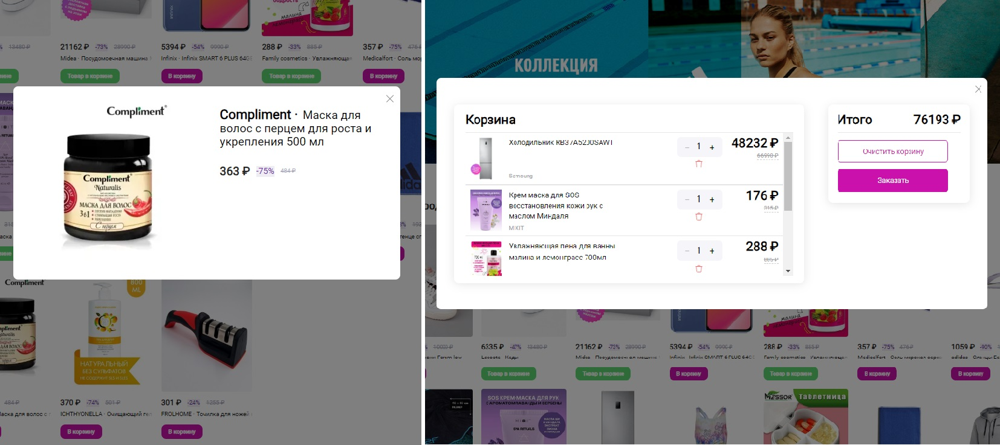

### Wildberries-clone project

[DemoLink](https://pavelbichukov.github.io/Wildberries-clone/)

---

## Description
This project is a copy of the online store *Wildberries*
 
 
## Functional

- changing banner slides
- adding products to cart
- view selected item
- search for different products

### :hammer_and_wrench: Languages and Tools :

  &nbsp;
  &nbsp;
  &nbsp;
  
  
  

